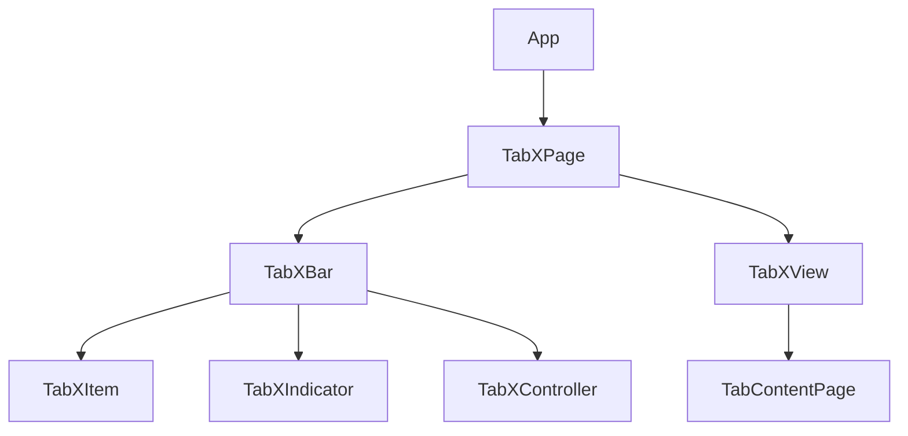

## 🧱 flutter_tabx 技术架构文档（Tech Architecture Doc）

### 1. 技术选型

| 技术领域  | 使用方案                                           |
| ----- | ---------------------------------------------- |
| 状态管理  | `TabXController`（基于 `ChangeNotifier`）          |
| 页面缓存  | IndexedStack / PageView + `AutomaticKeepAlive` |
| 动画支持  | Flutter 原生动画（如 Tween、AnimatedBuilder）          |
| 懒加载处理 | 页面加载时动态构建（builder + visibility）                |
| 指示器动画 | 自定义绘制 + 滑动同步                                   |
| 样式配置  | 支持 builder 模式、主题参数传入                           |

---

### 2. 组件结构图



---

### 3. 控制器设计 TabXController

```dart
class TabXController extends ChangeNotifier {
  final int length;
  int _index = 0;

  TabXController({required this.length});

  int get index => _index;

  void jumpTo(int index) {
    if (_index != index) {
      _index = index;
      notifyListeners();
    }
  }

  void next() => jumpTo((_index + 1) % length);
  void previous() => jumpTo((_index - 1 + length) % length);
}
```

---

### 4. TabXBar 功能设计

* 支持水平/垂直方向
* 支持图标、文本、角标等样式自定义
* 支持滑动和固定布局
* 支持自定义指示器样式
* 支持 itemBuilder 自定义每个Tab样式

---

### 5. TabXView 功能设计

* `lazyLoad`: 是否懒加载
* `keepAlive`: 是否保持状态缓存
* `scrollPhysics`: 是否支持滑动切换
* 子页面可感知显示状态（如 `onTabVisible`）

实现原理：

* 基于 `PageView` 或 `IndexedStack`
* 内部监听 `PageController` + `TabXController`
* 支持手动同步滑动位置

---

### 6. 使用边界与设计原则

#### 组件适用范围

* ✅ 页面内部频道切换（如 推荐 / 热榜 / 关注）
* ✅ 嵌套页面的二级导航
* ❌ 页面级主导航，不建议用于底部导航场景

#### 推荐组合结构：

```dart
Scaffold(
  bottomNavigationBar: BottomNavigationBar(...),
  body: IndexedStack(
    index: _tabIndex,
    children: [
      HomePage(),
      DiscoverPage(), // 内部使用 flutter_tabx
      ProfilePage(),
    ],
  ),
);
```

---

### 7. 发布与依赖管理

```yaml
name: flutter_tabx
description: 高可扩展的 TabBar + PageView 切换组件库
version: 0.1.0
repository: https://github.com/your-org/flutter_tabx
homepage: https://pub.dev/packages/flutter_tabx

environment:
  sdk: '>=3.0.0 <4.0.0'

dependencies:
  flutter:
    sdk: flutter
```

---

## 🚀 后续规划与优化方向

### 版本路线图

| 版本     | 功能                              |
| ------ | ------------------------------- |
| v0.1.0 | 支持基本频道切换、动画、懒加载                 |
| v0.2.0 | 嵌套滑动支持（NestedScrollView/Sliver） |
| v0.3.0 | 自定义切换动画、手势识别                    |
| v0.4.0 | 横向/纵向切换支持                       |
| v0.5.0 | 主题支持与多样化样式                      |

---

### 未来拓展方向

* tab 状态绑定动画（缩放/渐变）
* 频道拖动排序、自定义管理
* 支持多种切换特效（fade, scale, cube）
* 动态添加/删除Tab项
* 页面级生命周期注入

---

### 单元测试建议

* TabXController 状态切换正确性
* TabXView 懒加载与 keepAlive 测试
* TabXBar 渲染及交互一致性
* 指示器滑动同步准确性

---